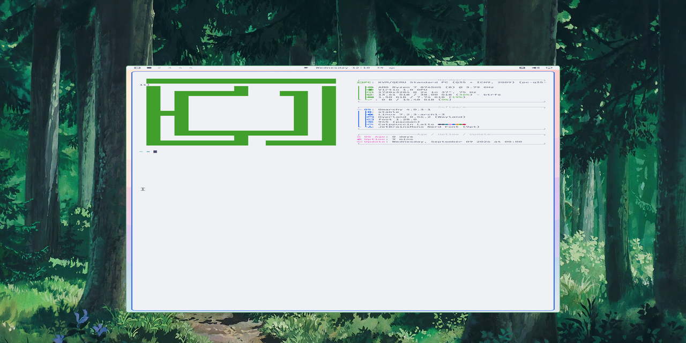

# Omarchy-in-Omarchy

A disposable [Omarchy](https://omarchy.org) machine running in QEMU/KVM on your Omarchy desktop, for testing plugins, themes and system changes without touching the machine you actually work on. Everything in it may break: the `fresh` snapshot stays clean and a new VM is one command.



The interesting part is that the guest installs itself and boots straight into Hyprland with nothing to type. No installer wizard, no disk passphrase, no login prompt. That takes a few deliberate choices, and the ones that are not obvious are written down below.

```bash
omavm install                    # unattended install from the ISO, ~30 min, once
omavm stop && omavm save fresh   # keep the result as the clean baseline

omavm boot                       # ~18 seconds to a running desktop
omavm ssh 'uname -a'             # run something as root in the guest
omavm shot screen.png            # screenshot of the guest desktop
omavm stop
```

## Requirements

Arch or Omarchy on the host, with `qemu-full`, `edk2-ovmf` and `mtools`. An Omarchy ISO from [iso.omarchy.org](https://iso.omarchy.org). KVM, 8 cores, 8 GB RAM and 40 GB of disk go to the guest by default.

## The unattended install

The shipped Omarchy ISO can install itself without a keyboard: it looks for a drive labelled `CIDATA` (the cloud-init NoCloud convention) holding archinstall's own answer files, and if it finds one it skips the configurator entirely. `omavm install` builds that drive, boots the ISO with it attached, waits for the installed system to come up and then provisions it.

Two files are mandatory on that drive, `user_configuration.json` and `user_credentials.json`; the optional ones cover the git identity, SSH keys and a Tailscale auth key. See the [omarchy-iso README](https://github.com/omacom-io/omarchy-iso#autoinstall) for the full list.

**Leaving out the `disk_encryption` block is what removes the passphrase prompt.** Encryption is configured entirely by that block inside `user_configuration.json`; the separate `user_encrypt_installation.txt` flag only has to agree with it. An encrypted install is never fully unattended, because the LUKS prompt still needs someone at the first boot.

That trade is the whole point here. A test VM that stops for a passphrase cannot be started from a script and cannot be left to install itself. What you give up is confidentiality of the guest disk, so nothing secret may live on it (see below).

### Two things a plain install does not give you

Both only show up once the encryption is gone, and both are handled by `omavm provision`.

**No autologin.** The installer wires up SDDM autologin for *encrypted* installs, on the reasoning that you already proved who you are by typing the passphrase. Without encryption it configures none, so the machine boots to a login screen and you are back to typing. The fix is a normal SDDM drop-in:

```ini
# /etc/sddm.conf.d/99-autologin.conf
[Autologin]
User=your-user
Session=hyprland-uwsm.desktop
Relogin=true
```

**`NOPASSWD` is not enough for sudo.** The installer writes its own `user ALL=(ALL) ALL` rule, and against that `sudo -v` keeps demanding a password even when a later rule grants `NOPASSWD: ALL`. `omarchy-update` calls exactly that to keep its sudo session warm, so system updates stall on a prompt on a machine that is supposed to need no typing. Add the stronger form:

```
Defaults:your-user !authenticate
your-user ALL=(ALL:ALL) NOPASSWD: ALL
```

## Secrets stay on the host

The guest has no disk encryption, has passwordless sudo and hands out root over SSH. Treat its disk as readable by anyone who gets at it, and never put a key, token or password in it, not even temporarily: a qcow2 keeps deleted content around and the snapshot travels with it.

When something in the guest genuinely needs one of your keys, forward the agent instead of copying the key:

```bash
omavm agent git -C ~/dotfiles push
omavm agent                          # interactive shell with the agent
```

The guest can ask the agent to sign, never to hand a key over, and that access disappears when the command returns. With 1Password's agent you also get a per-signature approval prompt on the host. Verified: `ssh -T git@github.com` authenticates from inside the guest while the VM holds no private key at all, and `ssh-add -l` outside `omavm agent` immediately reports no agent.

The same principle covers tokens: fetch them on the host and pass them as an environment variable on a single command, rather than writing them to a file in the guest.

## Looking at a guest that has no SSH yet

While the guest is installing or stuck at a prompt there is nothing to SSH into, and grabbing the QEMU window means going to whatever workspace it happens to be on. `omavm screendump` and `omavm sendkey` go through QEMU's QMP socket instead, so they need no cooperation from the guest and never touch the host desktop.

```bash
omavm screendump screen.png
omavm sendkey ret
omavm sendkey ctrl-alt-f2
```

`screendump` needs a software framebuffer, which GPU acceleration removes: with `virtio-vga-gl` QEMU answers `no surface`, and it refuses a second display outright with `Display vnc is incompatible with the GL context`. So `omavm install` runs the guest without acceleration, where seeing the screen matters more than speed, and `OMARCHY_VM_GL=0 omavm boot` does the same for a normal boot. `sendkey` always works.

Once the guest has a session, `omavm shot` is the better screenshot: it runs `grim` inside the guest, so it comes out sharp and correctly scaled.

## Commands

Run `omavm --help` for the full reference.

| | |
|---|---|
| `install`, `provision`, `dotfiles` | Build the machine; provision and dotfiles can be re-run against a running guest |
| `boot`, `resume`, `stop`, `status` | Lifecycle. `boot` starts clean from a snapshot, `resume` continues the active disk |
| `save`, `list` | Snapshots, in `vm-saves/`. Overwriting one needs `--force` |
| `ssh`, `user`, `agent`, `push`, `pull` | Work in the guest |
| `shot`, `screendump`, `sendkey` | See and drive the screen |
| `hypr`, `qs`, `restart-shell`, `plugin` | Hyprland, Quickshell and plugin testing |

## Gotchas

- Keep the active disk off `/tmp`. That is tmpfs, so a multi-gigabyte qcow2 lives entirely in RAM and starves the host until the OOM killer takes the VM. This uses `/var/tmp`, which a reboot still clears, so snapshots are what survives.
- Start QEMU in a systemd user unit rather than as a child of your shell, or the window vanishes the moment that session ends. `omavm` does this for you.
- Snapshot only a powered-off VM. Copying a live disk gives you an inconsistent image.
- A blanked guest screen hangs `grim` forever instead of failing, so `omavm shot` appears to freeze. `provision` therefore disables the screensaver and keeps the screen awake.
- A fresh install has empty pacman databases, because everything came from the mirror bundled on the ISO. Anything you install afterwards needs a `pacman -Sy` first.
- Clipboard sharing does not work with the SDL display. Use `omavm push` and `omavm pull`, or reach the host at `10.0.2.2` from inside the guest.
- Hyprland in the guest is Quattro, so `hyprctl dispatch` takes lua: `hl.dsp.focus({ workspace = 2 })`.

## Using it with an agent

`skill/SKILL.md` is an [agent skill](https://docs.claude.com/en/docs/agents-and-tools/agent-skills/overview) describing this setup, so Claude Code, Codex or another CLI agent can drive the VM without rediscovering the pitfalls above. Point your agent's skills directory at it:

```bash
# from the root of this repository
ln -s "$PWD/skill" ~/.claude/skills/vm
```

## Credits

`bin/omarchy-iso-boot` and `bin/omarchy-vm` come from [omacom-io/omarchy-iso](https://github.com/omacom-io/omarchy-iso) and carry small local patches: an `OMARCHY_VM_GL=0` switch to trade GPU acceleration for a readable framebuffer, and a path fix so `omarchy-vm` calls its neighbour rather than searching `PATH`. `bin/omavm` is the wrapper around them.

This whole thing started with [DHH answering a question about it](https://x.com/dhh/status/2094856301662835158) on 1 September 2026:

> You can use QEMU. Talk to your agent about it 😄. Tell it to look at omarchy-iso-boot in omacom/omarchy-iso.

So that is what happened, and this repository is where that conversation ended up.
